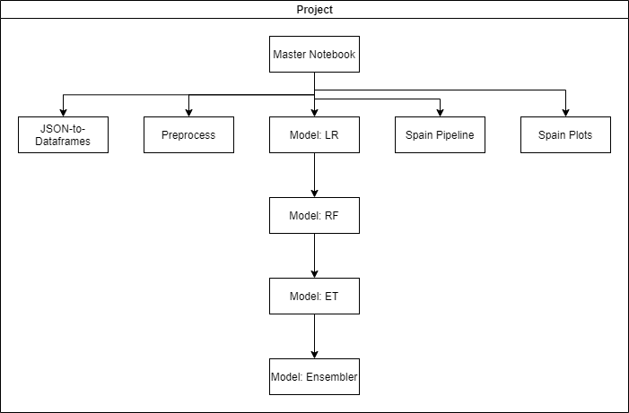

This repo contains the code for my bachelor's thesis (TFG): **Design and development of a machine learning system for fast food prevalence characterization using Social Media Mining**

**Abstract:**

An escalating global epidemic of overweight and obesity is taking over many parts of the world. Among several factors that influence this, dietary habits are a key element due to they have a profound impact on human life, health, and well-being. In addition, several chronic diseases have been linked to overweight and obesity, which have been found to be positively associated with eating fast-food. Thus, the study of dietary habits is important for both cultural understandings and for monitoring public health. Traditionally, large-scale dietary studies of food consumption used questionnaires and food diaries to keep track of the daily activities of their participants, which can be intrusive and expensive to conduct. In last years social networks have become a valuable source of information to assess the habits, opinions, and decisions taken by their users, so researches are examining ways to use social data to address health-related issues. Framed in a collaboration project part of the Food4Health European program, our work aims to determine if it is possible to characterize fast-food consumption through the in- formation of the messages posted on Twitter. For this purpose, we have made a classifier using machine learning techniques, available with Scikit-learn Python library, capable of classifying tweets from users referring to fast-food. In addition, we have enriched our system with the analysis of the images attached to tweets using both image classification and object detection models. They are based on convolutional neural networks focused on object recognition, and transfer learning techniques have been used to use pre-trained models in our objective, to recognize food. Also, sentiment and emotion analysis have been performed on tweets in order to assess the sentiments and emotions related to fast-food. This system has been tested in the Spanish case, assessing the fast-food prevalence in the country along with image and sentiment analysis to provide health-related information.

[Here you can find the project full document](http://www.gsi.upm.es/administrator/components/com_jresearch/files/publications/tfg-dani-vera.pdf)

Click in the image to watch the thesis video summary (1:14):

## About the code

The code is mainly written using jupyter notebooks and it's organized following the guidelines of this [Medium article](https://towardsdatascience.com/structuring-jupyter-notebooks-for-fast-and-iterative-machine-learning-experiments-e09b56fa26bb) about structuring jupyter notebooks.

The main notebooks are depicted in this figure:

* JSON-to-Dataframes.ipynb get the tweets from data/JSONFiles and convert all of them into a single CSV file. Also, it creates a CSV file with the location info of the tweets.
* Preprocess.ipynb gets the target CSVFiles, preprocess them as needed and creates a pickel file in data/temp
* Model-X.ipynb gets the preprocessed file, defines the features we are gonna use and trains model X. Then, saves it to exp/models.
* SpainPipeline.ipynb is used to extract information about a dataset of tweets from Spain using the trained models.
* SpainPlot.ipynb is used to generate visual figures and maps with the information extracted in previous notebooks.

There are also other notebooks and scripts:
* Annotation.ipynb is used to hand label the dataset (maybe not the most efficient way, but it worked)
* DownloadTweetPics.ipynb is used to download into data/images the images from the tweet dataset
* TwitterStreamer.py is used to stream tweets by keywords or location using tweepy. (it needs keys and tokens from twitter API)
* ImageObjectDetection.ipynb uses ResNet trained with COCO dataset to recognize objects in an image
* transfer_learning_model_for_image_recognition.ipynb is a work done by Alberto Sánchez (@sanxlop) and I use it to classify the food in twitter images into 101 categories.

Important final notes:
* All datasets(.csv) used in this work are provided in data/CSVFiles
* Also, a representative small dataset is provided for quick experimentation of the project workflow (smallData)
* It's possible some notebooks fails because they don't find a library or a path, but it should be easy to fix.
